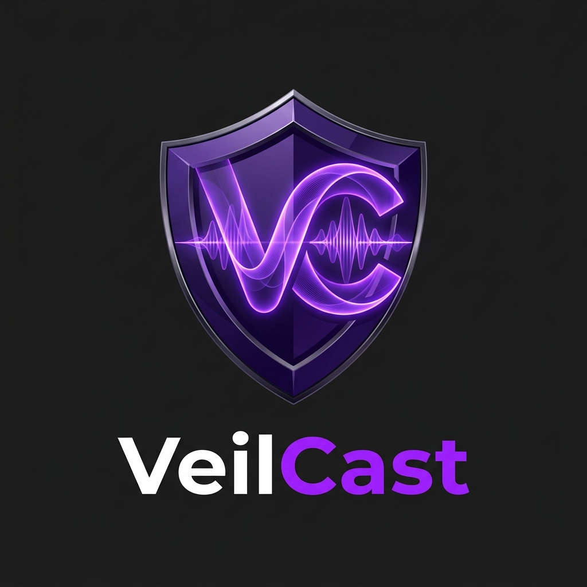

<div align="center">
  
  <h1>VeilCast 🛡️</h1>
  <p><strong>The Ultimate Privacy Shield for Windows Screen Sharing</strong></p>

  [](https://darksyntrix.pages.dev/)
  [](https://microsoft.com)
  [](LICENSE)
</div>

<br />

**VeilCast** is a premium, ultra-lightweight Windows utility designed to protect your privacy during screen sharing sessions. Whether you are presenting on Microsoft Teams, Zoom, Discord, or recording via OBS, VeilCast ensures that specific application windows remain completely invisible to your audience while staying fully visible to you.

---

## ✨ Premium Features

* 🎨 **Stunning UI Design:** A beautiful, dark-themed WPF interface featuring glassmorphic effects, rounded corners, and smooth toggle animations.
* 🛡️ **Absolute Invisibility:** Injected windows appear completely transparent or black to all screen capture software.
* ⚡ **Zero Overhead:** Consumes less than 2 MB of RAM and absolutely 0.0% CPU usage in the background. It only works when you interact with it.
* 🚀 **Portable Architecture:** Compiles down to a single `.exe` file (~300 KB) requiring no external DLLs or frameworks.
* ⚙️ **Professional Packaging:** Includes a fully-featured digital installer with custom file associations (`.vcfg`), shortcuts, and automated registry configurations.

---

## 🛠️ How it Works under the Hood

Windows OS provides the `SetWindowDisplayAffinity` API to exclude windows from screen captures. However, for security reasons, Windows restricts this API call exclusively to the process that owns the target window. 

**VeilCast bypasses this restriction.** It acts as a powerful controller that dynamically injects a minimal assembly thread (`CreateRemoteThread`) directly into the target process's memory space, instructing the application to execute the API on itself. 

---

## 🚀 Getting Started

### Installation

1. Download the **VeilCast Professional Installer** (`VeilCast_v1.0.0_Setup.exe`) from the Releases section.
2. Follow the setup wizard to install VeilCast on your system.
3. The installer will automatically configure VeilCast to launch with Administrator privileges (required for thread injection).

### Usage Guide

1. Open **VeilCast** from your Desktop or Start Menu.
2. A beautiful purple shield icon will appear in your System Tray (bottom right corner).
3. **Right-click** the tray icon and click **Open** to launch the premium dashboard.
4. Toggle the switches next to any active window. Watch as they instantly disappear from screen shares!

---

## 🏗️ Building from Source

To compile VeilCast yourself and generate the professional setup executable:

### Prerequisites
* .NET 9.0 SDK
* Inno Setup 7 (for generating the installer)

### Build Pipeline
Run the included PowerShell pipeline to automatically clean, build, and package the application:
```powershell
.\publish.ps1
```
Your compiled binaries and setup installer will be placed in the `dist/` directory.

---

<div align="center">
  <i>Developed with ❤️ for extreme privacy and professional environments.</i>
</div>